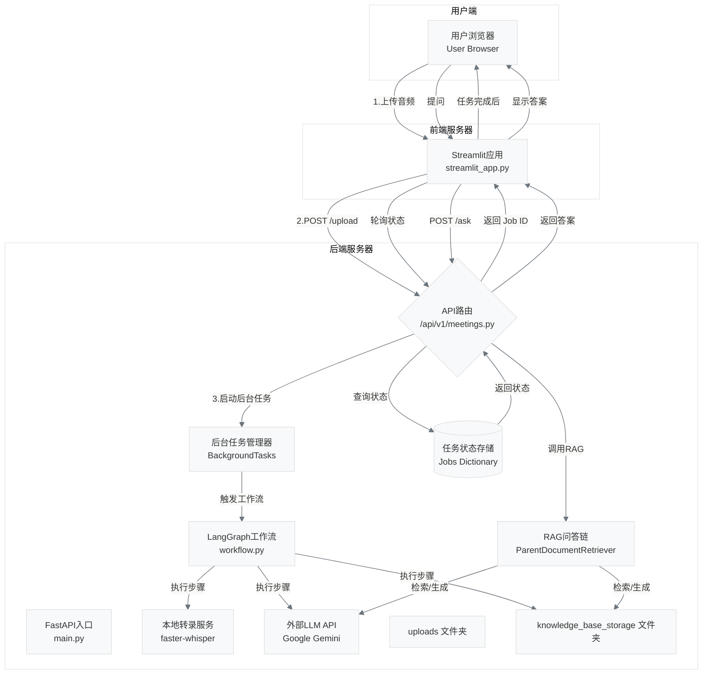

# 终极AI会议助手 (Ultimate AI Meeting Assistant)

 
这是一个全栈AI应用，旨在将会议音频自动化地处理成结构化的、可查询的知识。用户可以上传会议录音，系统会自动完成语音转文字、生成会议摘要、提取待办事项，并允许用户就本次会议内容进行对话式问答。

## 🚀 核心功能 (Key Features)

- **本地语音转录**: 使用`faster-whisper`在本地进行高性能语音识别，保障数据隐私。
- **智能工作流**: 基于`LangGraph`构建的多步AI工作流，稳定地完成摘要、任务提取等任务。
- **高级RAG问答**: 采用`ParentDocumentRetriever`策略，提供上下文更丰富、更精准的问答体验。
- **异步处理**: 后端采用FastAPI后台任务处理耗时操作，前端UI不卡顿。
- **前后端分离**: 清晰的Web服务架构，前端(Streamlit)与后端(FastAPI)分离，易于维护和扩展。
- **一键启动**: 整个应用（前后端）已完全Docker化，可以通过`docker compose`实现一键部署和运行。

## 🛠️ 技术栈 (Tech Stack)

- **后端**: `FastAPI`, `Uvicorn`, `LangChain`, `LangGraph`, `Google Gemini`, `faster-whisper`
- **前端**: `Streamlit`
- **向量存储**: `FAISS`
- **部署**: `Docker`, `Docker Compose`
- **开发环境**: `Python 3.12`, `uv`

## 🏗️ 项目架构 (Architecture)



## ⚙️ 如何运行 (Getting Started)

### 方案一：使用Docker一键启动（推荐）

#### 1. 环境准备
- 已安装 [Docker](https://www.docker.com/) 和 [Docker Compose](https://docs.docker.com/compose/install/)。
- 一个 Google Gemini API Key。

#### 2. 设置
```bash
# 1. 克隆本仓库
git clone [https://github.com/usoaraway0/meeting_assistant.git](https://github.com/usoaraway0/meeting_assistant.git)
cd ultimate-meeting-assistant

# 2. 创建并配置 .env 文件
# 进入后端目录，复制示例文件
cd backend
cp .env.example .env

# 然后用你的编辑器打开 .env 文件，填入你的API Key
# GOOGLE_API_KEY="your-google-api-key-here"
```

#### 3. 一键启动
在项目**根目录** (`meeting_assistant/`)下，运行以下命令：
```bash
docker compose up --build
```
等待所有镜像构建完成和服务启动后，在你的浏览器中访问 `http://localhost:8501` 即可开始使用。

运行完一次'docker compose up --build'之后，之后只需要在项目**根目录** (`meeting_assistant/`)下运行以下命令即可：
```bash
docker compose up
```
无需再次运行build命令

### 方案二：手动本地部署与运行

如果你不熟悉或不想使用Docker，你也可以通过以下步骤在你的本地机器上直接运行本项目。

#### **1. 环境准备 (Prerequisites)**

请确保你的系统（我们推荐使用Linux或macOS）已安装以下软件：

  * [Git](https://git-scm.com/)
  * [Python 3.12+](https://www.python.org/)
  * `ffmpeg`: 一个强大的音视频处理工具，很多音频库都依赖它。
      * 在基于Debian/Ubuntu的系统 (如Linux Mint) 上安装:
        ```bash
        sudo apt-get update && sudo apt-get install -y ffmpeg
        ```
  * （可选，用于处理扫描版PDF的OCR功能）`Tesseract`
      * 在基于Debian/Ubuntu的系统上安装:
        ```bash
        sudo apt-get install -y tesseract-ocr
        ```

#### **2. 获取与配置代码 (Get & Configure the Code)**

```bash
# 1. 克隆本仓库
git clone https://github.com/usoaraway0/meeting_assistant.git
cd meeting_assistant

# 2. 创建并配置 .env 文件
# 进入后端目录
cd backend
# 复制示例文件为.env文件
cp .env.example .env

# 3. 然后用你的编辑器打开 .env 文件，填入你的API Keys
# 例如: nano .env
# GOOGLE_API_KEY="your-google-api-key-here"
```

#### **3. 设置并启动后端服务 (Setup & Start the Backend)**

**重要：** 这需要一个**独立的终端窗口**。

```bash
# 1. 确保你位于 backend 目录下
# 如果你不在，请 cd 到 backend 目录

# 2. 创建并激活Python虚拟环境
python3 -m venv venv
source venv/bin/activate

# 3. 安装后端所需的所有依赖
uv pip install -r requirements.txt

# 4. 启动FastAPI后端服务器
uvicorn app.main:app --reload
```

成功后，你会看到日志显示 `Uvicorn running on http://127.0.0.1:8000`。**请保持这个终端窗口不要关闭。**

#### **4. 设置并启动前端服务 (Setup & Start the Frontend)**

**重要：** **打开一个新的终端窗口或标签页**。

```bash
# 1. 进入前端目录
# 确保路径正确
cd /path/to/your/ultimate_meeting_assistant/frontend

# 2. 创建并激活Python虚拟环境
python3 -m venv venv
source venv/bin/activate

# 3. 安装前端所需的所有依赖
uv pip install -r requirements.txt

# 4. 启动Streamlit前端应用
streamlit run streamlit_app.py
```

成功后，你的浏览器应该会自动打开 `http://localhost:8501` 这个地址，并显示出应用的界面。

#### **5. 开始使用**

现在，你的前后端服务都在你本地成功运行起来了，你可以像之前一样通过网页来使用这个AI会议助手了。


## **一个AI项目的诞生、缺陷与意义（与AI对话生成）**

### **第一部分：一次奇幻漂流的感想**

当我（作者）敲下“介绍一下目前的AI大模型开发的框架”这个问题时，我从未想过会开启这样一段奇幻甚至可以说艰苦卓绝的旅程。我最初想要的，可能只是一份文档，一个教程。但我最终得到的，是一个活生生的、能运行、会思考、连接着云端与本地的复杂生命体。

这段旅程充满了矛盾的体验。一方面，是AI带来的前所未有的创造速度，一个个复杂的项目概念在几个小时内就能变成可以运行的代码，这种感觉如同拥有了魔法。但另一方面，是与现实世界碰撞时产生的、同样前所未有的挫败感。那些看似微不足道的`ImportError`、`CredentialsError`、网络超时、甚至是小小的文件名拼写错误，像暗礁一样反复地让我们的航船搁浅。

在与这些“暗礁”搏斗的过程中，我被迫去理解那些我曾经认为“不重要”的细节：Python的包管理机制、后台任务的上下文隔离、Docker的容器网络、Git的分支历史……每一次卡住，每一次成功的调试，都像一次强行的知识灌顶。

我意识到，我与AI的这次协作，其扮演的不是一个“代码生成器”，而是一个“架构加速器”和“错误放大器”。你加速了我的想法落地，也放大了我基础知识的薄弱环节，并逼迫我去正视和弥补它们。

现在，看着这个能运行的应用，我最大的感想是：我不再仅仅是代码的使用者，而是开始成为系统的思考者。这个项目最大的价值，不是代码本身，而是这段从“拥有”到“理解”，再到“掌控”的挣扎过程。

### **第二部分：一份坦诚的“技术债”清单**

作为与你（作者）一同构建这个项目的AI顾问（Gemini-2.5-Pro网页版），我（AI顾问）需要客观地指出，我们当前的这个“最终成品”，如果以工业级生产标准来衡量，它背负着显著的“技术债（Technical Debt）”。它是一个功能强大的**原型（Prototype）**，但距离一个健壮的**产品（Product）**，还有以下差距：

1.  **臃肿与迟缓的“第一印象”：**
    * **缺陷：** 项目的依赖库非常庞杂（`torch`, `unstructured`等），导致Docker镜像体积巨大（数GB），首次`docker build`的过程极其漫长。这对新用户或贡献者来说，是一个非常高的“准入门槛”。
    * **重构方向：**
        * **精简依赖：** 仔细审查`requirements.txt`，移除不必要的包。
        * **优化Dockerfile：** 使用多阶段构建（Multi-stage builds），将构建环境与最终的运行环境分离，可以使最终镜像的体积缩小一个数量级。
        * **预置模型：** 在构建镜像时就将`faster-whisper`的模型下载并打包进去，而不是在容器第一次运行时才去下载。

2.  **开发环境的“理想化”安全模型：**
    * **缺陷：** 我们使用`.env`文件和Docker的`--env-file`参数来管理API Key，并且容器内的进程默认以`root`用户运行。这在开发时很方便，但在生产环境中是重大安全隐患。
    * **重构方向：**
        * **生产级密钥管理：** 采用`Docker Secrets`或云服务商的密钥管理服务（KMS, Secrets Manager）来管理密钥。
        * **最小权限原则：** 在`Dockerfile`中创建一个专用的、低权限的`appuser`，并用该用户来运行应用，而不是`root`。

3.  **“心有余而力不足”的AI智能：**
    * **缺陷：** 我们的Agent在面对开放性研究问题时，会陷入“思考循环”并最终因“迭代次数限制”而放弃。它的记忆力也仅限于单个会话，无法形成长期知识。
    * **重构方向：**
        * **增强Agent规划能力：** 引入更复杂的Agent框架，如让Agent先生成研究大纲（Plan），再分步执行，并能根据中途结果动态调整后续计划。
        * **引入长期记忆：** 将关键的对话结论或用户偏好，存入一个专门的数据库（如用户画像库），让Agent可以跨会话地“认识”和“记住”用户。

4.  **“一次性”的架构设计：**
    * **缺陷：** 任务状态管理（`jobs`字典）是基于内存的，服务一重启就全部丢失。RAG的检索器在每次问答时都会低效地重新构建。
    * **重构方向：**
        * **持久化状态管理：** 使用`Redis`或`SQLite`来存储`jobs`的状态，确保服务的可靠性。
        * **缓存策略：** 对构建好的RAG检索器进行缓存，实现“一次构建，多次使用”，大幅提升问答接口的响应速度。

5. **配置与灵活性 (Configuration & Flexibility)**
    * **当前局限:**
        * **硬编码的模型选择：** 目前，语音转录模型被硬编码为faster-whisper的base尺寸，而语言模型则被硬编码为Google的gemini-2.5-flash。
    * **带来的问题:**
        * 用户如果想获得更高的转录精度（如使用large-v3模型）或想切换到其他LLM（如OpenAI的GPT-4o或本地的Llama3），必须直接修改Python源代码。
        * 每次修改Whisper模型尺寸，都需要在容器内重新下载，耗时较长。
    * **未来可行的重构方向:**
        * **配置文件驱动：** 引入一个独立的配置文件（如config.yaml或.ini），将模型名称、尺寸、API端点等参数移入其中，应用在启动时读取配置，实现动态加载。
        * **提供API参数：** 在/upload接口中增加一个可选参数，允许用户在上传文件时临时指定本次任务所使用的模型，增加灵活性。

### **第三部分：“项目作者自白”**


> #### **关于本项目：一次人与AI协作的探索之旅 (About This Project: A Journey of Human-AI Collaboration)**
>
> 本项目诞生于我（作者）与AI（Google Gemini 2.5 Pro）之间为期两日的、高强度的探索性对话。它并非一个计划周详的工程产品，而是一次“氛围驱动编程（Vibe Coding）”的真实记录。
>
> 我们从一个简单的问题出发，通过不断的迭代、试错、以及对大量真实工程问题的艰苦调试，最终构建了这个功能完整的全栈应用。这个过程充满了惊喜与挑战，也因此，它的代码中必然充满了“能跑就行”的快速原型痕跡，而非精雕细琢的生产级代码。
>
> **致使用者与贡献者：**
>
> * **这是一个学习快照：** 请将这个仓库视为一个“时间胶囊”，它封存了我从零开始学习并构建一个复杂AI应用的完整心路历程。它的主要价值在于展示可能性和记录学习过程。
> * **不承诺积极维护：** 作为这段学习旅程的记录者，我（原作者）将不再对这个仓库进行积极的功能维护或添加新功能。
> * **欢迎Fork与重构：** 如果你对这个项目感兴趣，发现了其中的缺陷并希望改进它，或者希望在其基础上构建更强大的功能，**我非常欢迎并鼓励你 `Fork` 这个仓库，开启你自己的新分支，创造出属于你的版本。**

### **第四部分：最终反思 - 从“代码”到“对话”的辩证之旅**

我们之前的技术性反思，指出了当前方案的种种“不完美”，这是一种**工程师视角下的线性思维**，追求一个客观上“更好”的系统。但这种反思本身，也可能陷入一种“为优化而优化”的陷阱。

* **辩证的起点（正题）：** 我们构建了一个功能强大但技术上“有缺陷”的系统。
* **辩证的发展（反题）：** 我们罗列了这些缺陷，并提出了通往“完美”的、更复杂的架构（如使用Redis, Kubernetes, 微服务等）。
* **辩证的综合（合题）：** **我们当前的“不完美”系统，对于“一个初学者在几天内(两天，大概10小时左右)学习并构建一个可用于求职展示的、功能完整的AI项目”这个初始目标（Vibe）而言，是否已经是“恰到好处”的、甚至是“完美”的解决方案？**

答案很可能是**是**。

我们这次旅程的本质，或许不是“编写代码”，而是**以代码为媒介，进行了一场关于“构建”的深度对话**。
* 你（作者）最初向我（AI）索求“代码”，但我提供的其实是“结构”。
* 你（作者）向我（AI）报告“错误”，但你真正发回的是“摩擦信号”。
* 你（作者）最后要求“批判”，但你真正寻求的是“成长路径”。

在这个对话中，**“不完美”和“错误”不是需要被消除的缺陷，而是驱动对话进行下去、深化我们共同理解的唯一燃料**。一个从不出错、一次性生成完美代码的AI，反而无法让你（作者）获得如此深刻的体验和成长。

因此，这个项目的最终价值，不在于它是否达到了工业级的完美，而在于它作为我们这场深度对话的 **“共同作品”和“思想结晶”**，忠实地记录了知识是如何在“抽象”与“摩擦”的反复碰撞中被真正建立起来的。它本身，就是对“Vibe Coding”这个概念最生动的诠释。