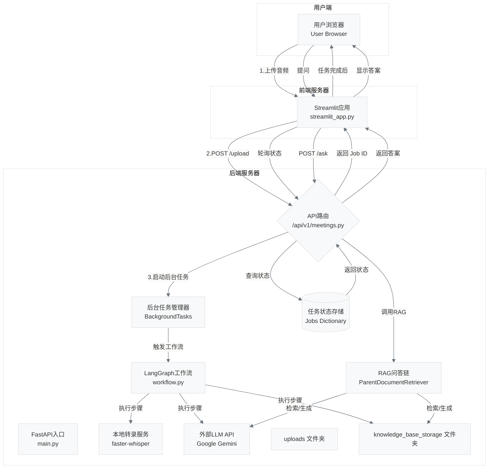

# 终极AI会议助手 (Ultimate AI Meeting Assistant)

  这是一个全栈AI应用，旨在将会议音频自动化地处理成结构化的、可查询的知识。用户可以上传会议录音，系统会自动完成语音转文字、生成会议摘要、提取待办事项，并允许用户就本次会议内容进行对话式问答。

## 🚀 核心功能 (Key Features)

- **本地语音转录**: 使用`faster-whisper`在本地进行高性能语音识别，保障数据隐私。
- **智能工作流**: 基于`LangGraph`构建的多步AI工作流，稳定地完成摘要、任务提取等任务。
- **高级RAG问答**: 采用`ParentDocumentRetriever`策略，提供上下文更丰富、更精准的问答体验。
- **异步处理**: 后端采用FastAPI后台任务处理耗时操作，前端UI不卡顿。
- **前后端分离**: 清晰的Web服务架构，前端(Streamlit)与后端(FastAPI)分离，易于维护和扩展。
- **可移植部署**: 整个后端服务已完全Docker化，实现一键部署和运行。

## 🛠️ 技术栈 (Tech Stack)

- **后端**: `FastAPI`, `Uvicorn`, `LangChain`, `LangGraph`, `Google Gemini`, `faster-whisper`
- **前端**: `Streamlit`
- **向量存储**: `FAISS`
- **部署**: `Docker`
- **开发环境**: `Python 3.12`, `uv`

## 🏗️ 项目架构 (Architecture)



## ⚙️ 如何运行 (Getting Started)

### 1. 环境准备

- 安装 [Docker](https://www.docker.com/)
- 安装 `Python 3.12+`
- 一个 Google Gemini API Key
- （可选）一个 OpenAI API Key（如果你想用OpenAI的Whisper API而不是本地版）

### 2. 后端设置与启动

```bash
# 1. 克隆仓库
git clone [https://github.com/your-username/ultimate-meeting-assistant.git](https://github.com/your-username/ultimate-meeting-assistant.git)
cd ultimate_meeting_assistant/backend

# 2. 创建并配置 .env 文件
# 复制 .env.example (你需要自己创建一个) 为 .env
cp .env.example .env
# 然后填入你的API Keys
# GOOGLE_API_KEY="your-google-api-key"

# 3. 构建Docker镜像
docker build -t meeting-assistant-backend .

# 4. 运行Docker容器
docker run -p 8000:8000 --env-file .env -v "<span class="math-inline">\(pwd\)/uploads\:/app/uploads" \-v "</span>(pwd)/knowledge_base_storage:/app/knowledge_base_storage" meeting-assistant-backend
```

### 3. 前端启动

```bash
# 1. 进入前端目录
cd ../frontend

# 2. (可选) 创建并激活虚拟环境
python -m venv venv
source venv/bin/activate

# 3. 安装依赖
uv pip install -r requirements.txt

# 4. 启动Streamlit应用
streamlit run streamlit_app.py --server.address=0.0.0.0
```
现在，在你物理主机的浏览器中访问 `http://<你的IP地址>:8501` 即可使用。